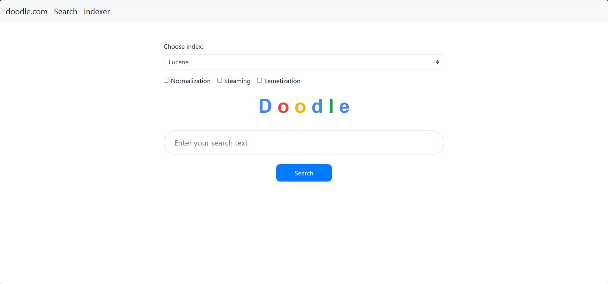

# Doodle



## Table of Contents

- [Description](#description)
- [Features](#features)
- [Technologies Used](#technologies-used)
- [Installation](#installation)
- [Usage](#usage)
- [Tests](#tests)
- [Contributing](#contributing)
- [License](#license)
- [Contact](#contact)

## Description

This project is an implementation of an Information Retrieval system, built using Java, Spring Boot, and Maven. The core functionality revolves around the processing and understanding of unstructured data, with the goal of extracting meaningful information.

One of the key components of this project is the Porter Stemming algorithm, a process for removing the commoner morphological and inflexional endings from words in English. This algorithm is crucial for the normalization of words, which is a fundamental step in many natural language processing tasks, including information retrieval.

The system is designed to read text from a list of files, stem each word, and write the result to standard output. This process aids in the reduction of the complexity of the data and improves the efficiency of the retrieval process.

The project is structured to be easily understandable and extendable, following best practices in software development. It serves as a solid foundation for any developer looking to delve into the world of information retrieval and natural language processing.

## Features

- **Text Processing**: The system is capable of reading and processing text from a list of files. This includes normalization of words, which is a fundamental step in many natural language processing tasks.

- **Porter Stemming Algorithm**: The project implements the Porter Stemming algorithm, a process for removing the commoner morphological and inflexional endings from words in English. This aids in the reduction of the complexity of the data and improves the efficiency of the retrieval process.

- **Efficient Information Retrieval**: The system is designed to efficiently retrieve information from unstructured data. It does this by stemming each word and writing the result to standard output.

- **Extendable Structure**: The project is structured to be easily understandable and extendable, following best practices in software development. It serves as a solid foundation for any developer looking to delve into the world of information retrieval and natural language processing.

- **Built with Robust Technologies**: The project is built using Java, Spring Boot, and Maven, robust and widely-used technologies in the software development industry.

## Technologies Used

- Java
- Spring Boot
- Maven
- HTML
- CSS
- Bootstrap

## Installation

Before you start, ensure you have installed the following prerequisites on your machine:

- Java Development Kit (JDK) 11 or later
- Maven
- An IDE of your choice (e.g., IntelliJ IDEA)

Follow the steps below to get the project up and running on your local machine:

1. **Clone the repository**

   Open a terminal and run the following git command:

   ```bash
   git clone https://github.com/yousofkortam/Doodle.git
    ```
   
2. **Open the project in your IDE**

   Navigate to the project directory and open it in your preferred IDE.

3. **Run the application**
   
   After a successful build, run the application by executing the `main` method in the `IrProjectApplication` class.

## Usage

1. **Start the Application**

   Run the application by executing the `main` method in the `IrProjectApplication` class. This will start the Spring Boot application.

2. **Prepare the Text Files**

   The system is designed to read text from a list of files. Make sure you have your text files ready in a directory. The text in these files should be in lower case as the Porter Stemming algorithm expects lower case input.

3. **Run the Porter Stemmer**

   The main method in the `PorterStemmer` class reads text from the list of files, stems each word, and writes the result to standard output. To use this, you need to pass the paths of your text files as arguments to the `PorterStemmer`'s main method.

4. **View the Results**

   The stemmed words will be printed to the standard output. You can review these results to understand the output of the Porter Stemming algorithm.

